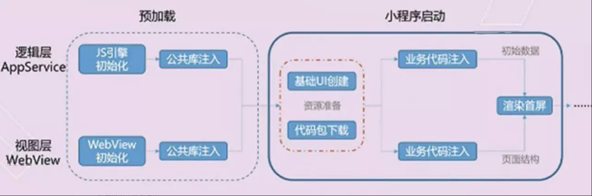

# 小程序性能优化

小程序的性能优化是一个我们开发小程序时需要特别注意的一个点。需要在开发的时候不仅仅是完成业务需求，而需要我们有更多的思考。从而达到更好的效果。

# Navigator

* [小程序原理](#小程序原理)

* [首次启动性能优化](#首次启动性能优化)

* [渲染性能优化](#渲染性能优化)

* [图片静态资源的处理](#图片静态资源的处理)

## 小程序原理

首先我们要想优化小程序的性能就得弄清楚小程序的原理是怎么样的，包括加载方式和小程序的编辑。在微信里面的运行环境，弄清楚之后才能有更多的对于优化的思考。

### 小程序的运行原理

微信小程序的框架包含两部分View视图层、App Service逻辑层。View层用来喧嚷页面结果，AppService层用来逻辑处理、数据请求、接口调用，它们在两个进程（类似于两个webview）里运行

视图层和逻辑层通过中间层的JSBridage进行通信，逻辑层把数据变化通知到视图层，触发视图层页面更新，视图层把触发的事件通知到逻辑层进行业务处理。

基本架构图如图所示

## 首次启动性能优化

要对小程序首次启动的性能进行优化，我们首先得搞清楚小程序启动的原理和小程序加载的原理从而更好的对症下药。来处理小程序启动的问题。可以把小程序启动理解成三个阶段。下载小程序代码包、加载小程序代码包、初始化小程序首页

下载小程序代码包是指小程序经过编译、压缩、打包之后的代码包（可以理解成小程序经过这三个操作之后打包成一个html文件）

加载小程序代码包

微信会在小程序启动前为小程序准备好通用的运行环境。这个运行环境包括几个供小程序使用的线程，并在其中完成小程序基础库的初始化，预先执行通用逻辑，尽可能做好小程序的启动准备。这样可以显著减少小程序的启动时间。

如图所示

对于小程序首次启动性能优化解决方案

控制包大小：上传代码时要先进行压缩、静态图片资源除小的icon外其余放到cdn、无用代码清除；

分包加载：根据业务场景，将用户访问率高的页面放在主包里，将访问率低的页面放入子包里，按需加载；

分包预加载：在进入小程序某个页面时，由框架自动预下载可能需要的分包，提升进入后续分包页面时的启动速度。对于独立分包，也可以预下载主包。分包预下载 官方文档链接

独立分包技术：区别于子包，和主包之间是无关的，在功能比较独立的子包里，使用户只需下载分包资源；

### 渲染性能优化

1、数据渲染优化
双线程下的界面渲染，小程序的逻辑层和渲染层是分开的两个线程。在渲染层，宿主环境会把WXML转化成对应的JS对象，在逻辑层发生数据变更的时候，我们需要通过宿主环境提供的setData方法把数据从逻辑层传递到渲染层，再经过对比前后差异，把差异应用在原来的Dom树上，渲染出正确的UI界面。

针对渲染性能优化可以做如下操作
1.不要过于频繁调用setData，应考虑将多次setData合并成一次setData调用；
2.初始化数据时，与界面渲染无关的数据最好不要设置在data中，可以考虑设置在page对象的其他字段下；

2、对于一些长列表的优化
有一些长列表页面，数据很多的话会对小程序的dom增加很长，从而导致小程序的内存会增大。对于一些低端机用户会导致小程序崩溃从而对小程序产生不好的体验。

解决方案：针对这种情况我们可考虑无限轮播图的实现思路。只加载用户的可视图范围内的列表长度，和一些预加载列表从而解决dom增多而产生的内存消耗问题

## 图片静态资源预加载

图片资源的加载对于目前我们的小程序加载是最容易去优化的一个项目。也是比较容易入手的。也可以减少小程序的代码体积

首先可以通过小程序的代码依赖分析来分析小程序中代码体积占比一目了然。

1、对一些不是必要的图片资源不要放到小程序项目里面，及时清理小程序中未使用的图片资源进行删除。

2、对一些图片链接上cdn。优化图片的访问的数据和对图片进行缓存
上cdn的好处：
(1)节省骨干网带宽，减少带宽需求量； 
(2)提供服务器端加速，解决由于用户访问量大造成的服务器过载问题； 
(3)服务商能使用Web Cache技术在本地缓存用户访问过的Web页面和对象，实现相同对象的访问无须占用主干的出口带宽，并提高用户访问因特网页面的相应时间的需求； 
(4)能克服网站分布不均的问题，并且能降低网站自身建设和维护成本； 
(5)降低“通信风暴”的影响，提高网络访问的稳定性。 

3、小程序使用iconfont矢量图标

